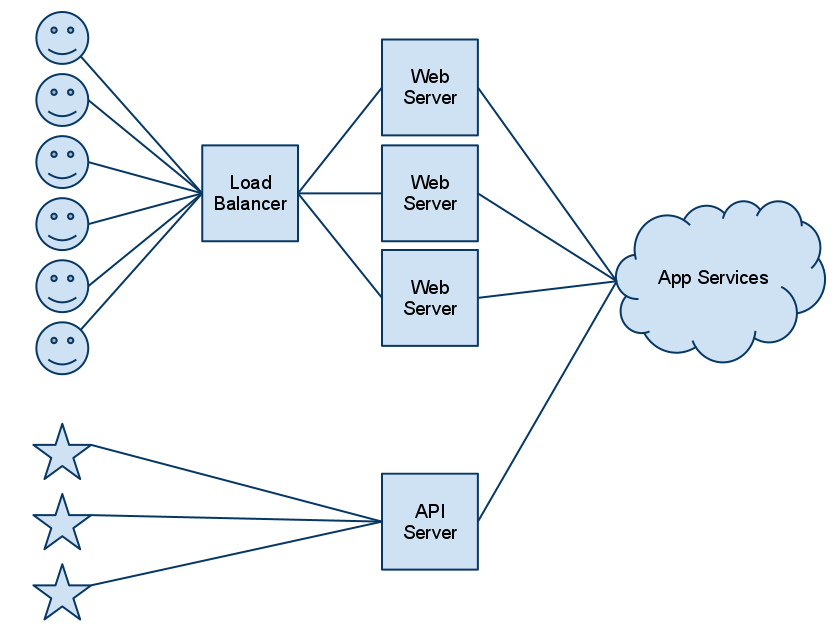
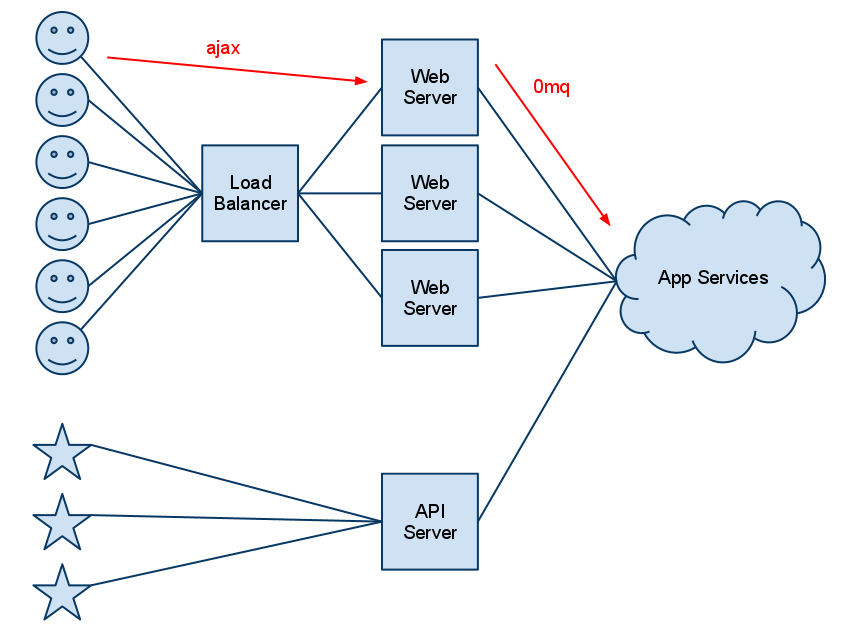
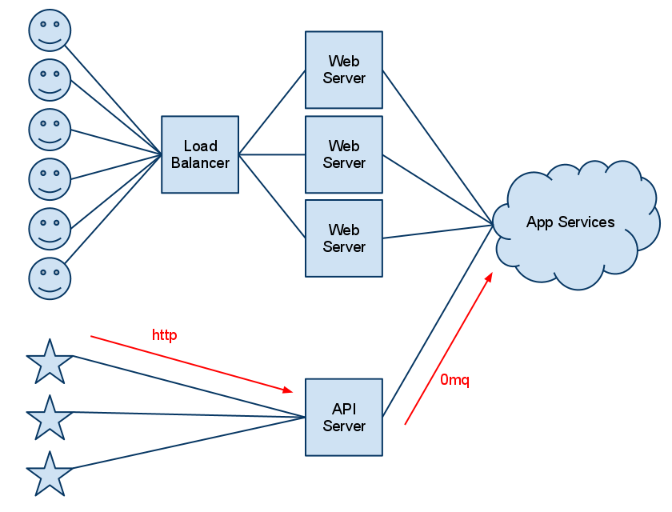
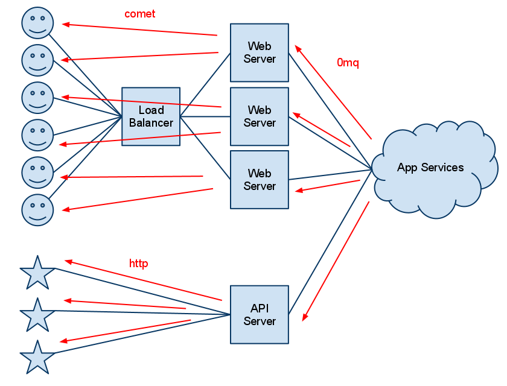

!SLIDE
# Pushing the Web Around 

!SLIDE bullets
# Overall
- we have easy-to-use technologies for making web apps more real-time & collaborative
- improves UX, makes new product ideas possible
- push events to users as they happen, no page reloads, no polling
 
!SLIDE smbullets incremental
# Example apps
- Facebook chat
- Facebook stream
- Twitter web ui (n new tweets)
- Instagram PubSubHubBub
- Meetup RSVP Stream
- Google Wave, Novell Vibe
- Google Docs (how we wrote our submission abstract)
- Tweetdeck using Twitter Streaming API
 
!SLIDE
# Example APIs

!SLIDE small
    curl -u IowaCodeCamp1:iowacodecamp -i \ 
    http://stream.twitter.com/1/statuses/sample.json

!SLIDE 
    curl -i http://stream.meetup.com/2/rsvps

!SLIDE smbullets
# Instagram Real Time
- [Demo](http://demo.instagram.com/)

!SLIDE smbullets
# Background on real-time web?
- [In a hundred words (Read Write Web)](http://www.readwriteweb.com/archives/explaining_the_real-time_web_in_100_words_or_less.php)
- "The Real-Time Web is a paradigm based on pushing information to users as soon as it's available - instead of requiring that they or their software check a source periodically for updates. It can be enabled in many different ways and can require a different technical architecture. It's being implemented in social networking, search, news and elsewhere - making those experiences more like Instant Messaging and facilitating unpredictable innovations. Early benefits include increased user engagement ("flow") and decreased server loads, but these are early days. Real-time information delivery will likely become ubiquitous, a requirement for almost any website or service."
- "real-time web" is not "real-time computing" or "real-time OS" or...

!SLIDE smbullets incremental
# General approach & specific technologies:
- User is using a web-connected application
- Desktop or mobile web app (ie browser)
- Any app that can use streaming web API
- events from user to system: ajax or websockets
- events from system to user: comet or websockets or long http response or pubsubhubbub
- events between system components: 0mq or PubSubHubBub or amqp or XMPP or JMS
- events within a system component: akka/lift

!SLIDE smbullets incremental
# WTF is X?
- What is ajax?
- What is comet?
- What is long http response?
- What is 0mq?
- What is akka?
- What is lift?

!SLIDE smbullets incremental
# Other specific technologies to reference:
- websockets
- XMPP / JMS
- [node.js](http://nodejs.org/)
- [netty](http://www.jboss.org/netty/)
- [pusher](http://pusher.com/)
- mobile push

!SLIDE smbullets
# Example app: nearby users

!SLIDE center

!SLIDE center

!SLIDE center

!SLIDE center

!SLIDE bullets
# Run it now
- [https://something.socket.io](https://something.socket.io)

!SLIDE smbullets incremental
# Low-level UserAt events
- Browser sends UserAt event to Web (every n secs): jQuery ajax post to Lift rest handler
- Web sends UserAt event to Central: 0mq push socket sends msg to 0mq pull socket
- Central sends UserAt events to all Webs: 0mq pub socket sends msg to 0mq sub sockets
- Web sends UserAt event to Browser: Lift comet calls JS function, adds markers to map

!SLIDE
# Low-level UserGone events (same as low-level UserAt)

!SLIDE small
    @@@ javascript
    jQuery(window).ready(function() {
        if (navigator.geolocation) {
       	    navigator.geolocation.watchPosition(onLocation, 
                                                onError);
        } else {
       	    alert("Sorry, no navigator");
        }
    });
    
!SLIDE small     
    @@@ javascript
    function onLocation(position) {
        latitude = position.coords.latitude;
        longitude = position.coords.longitude;
        sendLocation();
        if (!scheduled) {
             setInterval("sendLocation()", delay);
             scheduled = true;
        }
    }

!SLIDE small
# Web: Rest API
    @@@ scala
    object RestApi extends RestHelper {
      serve {
        case Post(List("location"), _) =>
          for {
            user <- LiftUser.signedIn
            lat <- S param "latitude" map { _.toDouble }
            lng <- S param "longitude" map { _.toDouble }
          } {
            user.location = Full(Location(lat, lng))
            CentralPush ! UserAt(User(user.username), 
                                 Location(lat, lng))
          }
          OkResponse()
      }
    }

!SLIDE small
# Web: Push Socket
    @@@ scala
    object CentralPush 
    extends Push(Props.get("centralPushEndpoint", 
                           "tcp://localhost:5558")) 
    with Connect

    
!SLIDE small
# Protocol: Models
    @@@ scala
    case class UserAt(user: User, location: Location)
    
    case class UserGone(user: User)
    
    case class UserNearby(target: User, whoNearby: UserAt)
    
    case class UserNoLongerNearby(target: User, 
                                  whoLeft: UserGone)
                                  
!SLIDE smaller
# Central: ZeroMQ Receiver
    @@@ scala
    class ZMQSocketMessageReceiver(port: Int) 
    extends Actor with ZMQContext with Listeners {
      import ProtocolDeserialization._
      import ZMQMultipart._
      
      lazy val pullSocket = {
        val pullSocket = context.socket(ZMQ.PULL)
        pullSocket.bind("tcp://*:" + port)
        pullSocket
      }
    
      def receive = listenerManagement orElse {
        case ReceiveMessage =>
          val message = ((blockingReadTwoPartMessage _) 
                         andThen 
                         (deserializeMessage _))(pullSocket)
          gossip(message)
          self ! ReceiveMessage
      }
    }
                                      

!SLIDE small
# Central: Publish Broadcast
    @@@ scala
    class ZMQSocketBroadcastPublisher(val port: Int) 
    extends Actor with ZMQContext with ZMQPubSocket {
    
      import ProtocolSerialization._
      import ZMQMultipart._
      
      def receive = {
        case msg @ UserAt(user, location) =>
          writeTwoPartMessage(serializeToMessage(msg), 
                              pubSocket)
        case msg @ UserGone(who) =>
          writeTwoPartMessage(serializeToMessage(msg), 
                              pubSocket)
      }
    }

!SLIDE smbullets incremental
# High-level UserNearby events
- Browser sends UserAt event to Web
- Web sends UserAt event to Central
- Central sends UserNearby events to all Webs
- Web filters out UserNearby events not relevant to signed-in user
- Web adds newly nearby users to Browser: Lift comet calls jQuery functions to add & fade in <li>

!SLIDE smaller
# Central: Nearby Users Broadcast
    @@@ scala
    class NearbyUsersBroadcast(centralNearbyPublisher: ActorRef) 
    extends Actor {
      var userLocations: Map[User, Location] = Map()
    
      def receive = {
        case msg @ UserAt(user, location) =>
          forThoseWithin5kmOf(user, location) { otherUser =>
            centralNearbyPublisher ! UserNearby(otherUser, msg)
          }
          userLocations += (user -> location)
        case msg @ UserGone(who) =>
          val location = userLocations(who)
          forThoseWithin5kmOf(who, location) { otherUser =>
            centralNearbyPublisher ! UserNoLongerNearby(otherUser, 
                                                        msg)
          }
          userLocations -= who
      }
    
      def forThoseWithin5kmOf(user: User, from: Location)
                             (f: (User) => Unit) {
        for {
          (u, l) <- userLocations if l.within5km(from) && u != user
        } f(u)
      }
    }
    

!SLIDE smaller
# Web: Nearby Comet Actor
    @@@ scala
    class NearbyUsers extends CometActor with Logger {
      val subscribe = new FilterableSubscribe(...)
    
      def render = NodeSeq.Empty
      
      override def lowPriority = {
        case UserNearby(_, UserAt(other, _)) => 
          if (!(users contains other)) {
            users += other
            debug(other + " is now nearby")
            partialUpdate(PrependAndFade(containerId, 
                                         render(other), 
                                         id(other)))
          }
        case UserNoLongerNearby(_, UserGone(other)) => 
          if (users contains other) {
            users -= other
            debug(other + " is no longer nearby")
            partialUpdate(FadeAndRemove(id(other)))
          }
      }
    }
    
!SLIDE 
# Web: rendering a user
    @@@ scala
    def render(u: User) = 
       <li id={ id(u) } style="display:none;">
         { u.username }
       </li>
    
                
!SLIDE smbullets
# High-level UserNotNearby events
- On UserGone, Central sends UserNoLongerNearby for all relevant users to all Webs
- Web removes user from list in Browser: Lift comet calls jQuery functions to fade out & remove <li>
    
!SLIDE smbullets
# Streaming API    

!SLIDE
# API: Plan
    @@@ scala
    class ApiPlan extends channel.Plan {
      import Streams._
      
      def intent = {
        case req @ GET(Path("/all")) =>
          allStream ! AddReq(req)
      }
    }

!SLIDE
# API: All Stream
    @@@scala
    class AllStreamActor extends Actor 
    with ChunkedJsonChannelSupport {
    
      def receive = channelManagement orElse {
        case msg: UserAt => 
          writeChunk(tojson(msg))
        case msg: UserGone => 
          writeChunk(tojson(msg))
      }
    }
    
!SLIDE smaller
    @@@scala
    class CentralSub(port: Int) 
    extends Actor with ZMQContext with Listeners {
      import ProtocolDeserialization._
      import ZMQMultipart._
    
      lazy val subSocket = {
        val subSocket = context.socket(ZMQ.SUB)
        subSocket.connect("tcp://*:" + port)
        subSocket.subscribe("".getBytes)
        subSocket
      }
    
      def receive = listenerManagement orElse {
        case ReceiveMessage =>
          val message = ((blockingReadTwoPartMessage _) 
                         andThen 
                         (deserializeMessage _))(subSocket)
          log.info("central sub received message " + message)
          gossip(message)
          self ! ReceiveMessage
      }
    }
    
!SLIDE smaller
# API: Chunking
    @@@ scala
    trait ChunkedJsonChannelSupport {
      import Headers._
      val clients = new DefaultChannelGroup
    
      def chunk(json: JsValue) =
        new DefaultHttpChunk(
          ChannelBuffers.copiedBuffer((json + "\n").getBytes("utf-8")))
    
      def writeChunk(json: JsValue) = clients.write(chunk(json))
      
      def channelManagement = {
        case AddReq(req) =>
          val ch = req.underlying.event.getChannel
          val initial = req.underlying.defaultResponse(ChunkedJson)
          ch.write(initial).addListener { () =>
            clients add ch
          }
      }
    
      implicit def block2listener[T](block: () => T): 
        ChannelFutureListener = new ChannelFutureListener {
          def operationComplete(future: ChannelFuture) { block() }
       }
    }
        
    
!SLIDE bullets
# Code
- Up on Github
- [https://github.com/iowacodecamp-push-web/iowacodecamp-push-web](https://github.com/iowacodecamp-push-web/iowacodecamp-push-web)
   
!SLIDE smbullets
# What else could you build?
- Chat built on nearby users app: chat rooms form for nearby users
- Geo events on nearby users app: tweets, instagram photos, 4sq checkins, Facebook...
- Zaarly
- Auction site: real-time aunction updates, no page reloads
- Collaboration software: multiple people editing same UI at same time
- Pongr: new photos, likes, notifications, comments, trends...

!SLIDE
# Any questions?

!SLIDE
# Thanks
